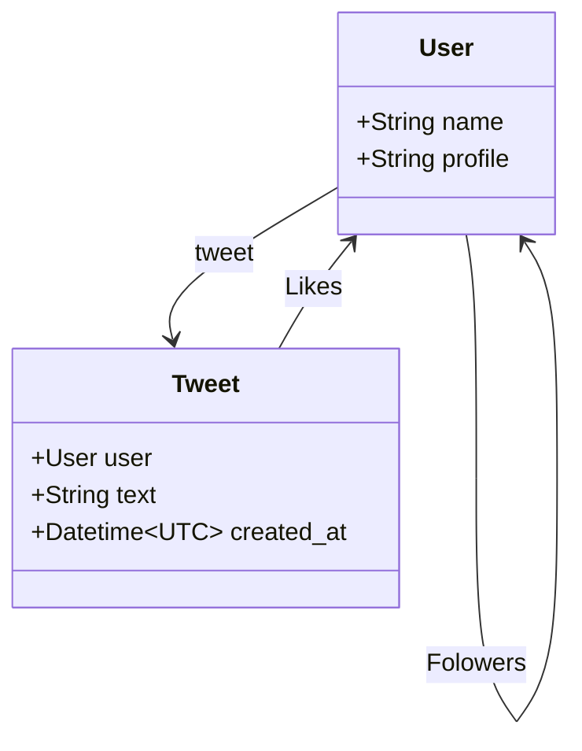

# Twitter clone

Twitter clone with Kotlin.

## Features

- [ ] GraphQL API
- [ ] Signup, Login, Logout
- [ ] Tweet
- [ ] Follow users
- [ ] Timeline(home, users)
- [ ] Like tweet
- [ ] Profile Page

## Models

## APIs

use GraphQL.