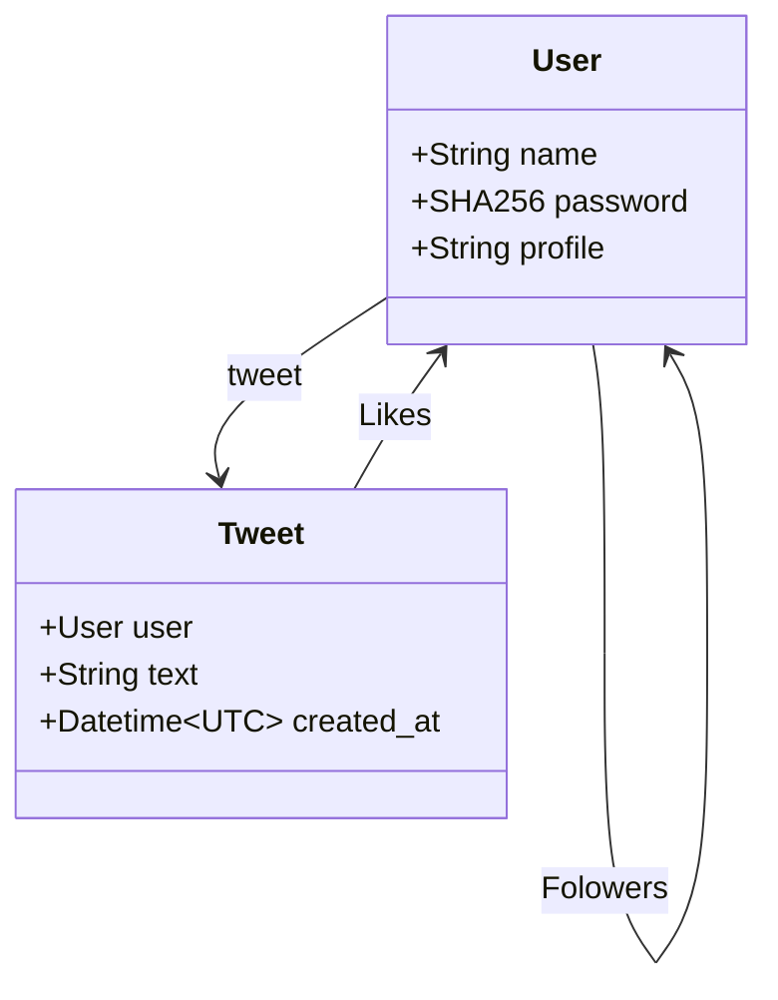

# Twitter clone

Twitter clone with Kotlin.

## Usage

```shell
export DB_URL="jdbc:h2:mem:twitter-clone;DB_CLOSE_DELAY=-1"
export DB_USER="USER"
export DB_PASSWORD="PASSWORD"
./gradlew run
```

## Features

- [ ] GraphQL API
  * [x] Signup, Login, Logout
  * [x] Tweet
  * [x] Follow users
  * [x] Like tweet

- [ ] Frontend
  * [x] Signup, Login, Logout
  * [x] Tweet
  * [x] Like tweet
  * [ ] Follow users
  * [x] Main Page
  * [ ] Profile Page

## Models



## APIs

```graphql
type Mutation {
  like(tweetId: String!): TweetData!
  login(name: String!, password: String!): UserData!
  logout: Boolean!
  signup(name: String!, password: String!): UserData!
  tweet(text: String!): TweetData!
  verify(token: String!): UserData!
}

type Query {
  tweets(limit: Int, offset: Int, tweetIds: [String!], userIds: [String!]): [TweetData!]!
  users(id: String): [UserData!]!
}
```