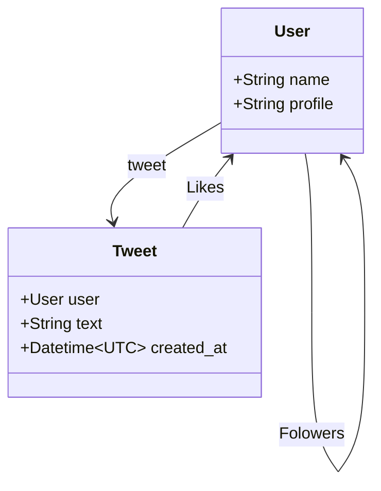

# Twitter clone

Twitter clone with Kotlin.

## Usage

```shell
export DB_URL="jdbc:h2:mem:twitter-clone;DB_CLOSE_DELAY=-1"
export DB_USER="USER"
export DB_PASSWORD="PASSWORD"
./gradlew run
```

## Features

- [ ] GraphQL API
- [ ] Signup, Login, Logout
- [ ] Tweet
- [ ] Follow users
- [ ] Timeline(home, users)
- [ ] Like tweet
- [ ] Profile Page

## Models



## APIs

use GraphQL.